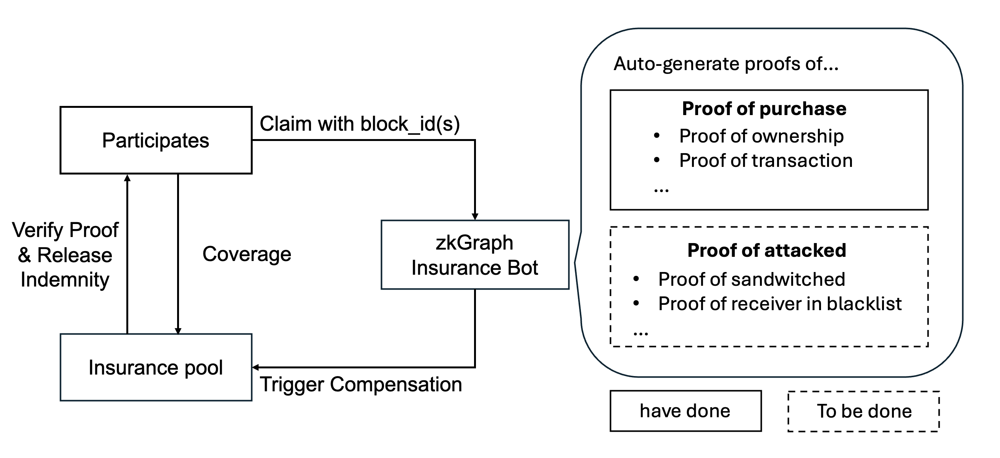

# zkGraph zkInsurance

## 

Traditionally, when something is broken and we file a claim for our insurance,  you need to show them your proof of purchase/ proof of ownership. It usually involves a lot of human work and there is very little standardization about proof of purchase: what counts and what not? With blockchain, the transaction is the natural proof of purchase. We can leverage this along with zkgraph to make it even easier for an insurance company to deal with such claims automatically.

A user only needs to submit their transaction block_id and that's it. Other stuff will be handled by the insurance policy written in zkgraph. 

## Usage CLI

> Note: Only `full` image will be processed by zkOracle node. `local` (generated by commands ending with `--local` option) means the zkGraph is compiled locally and only contains partial computation (so that proving and executing will be faster).

The workflow of local zkGraph development must follow: `Develop` (code in /src) -> `Compile` (get compiled wasm image) -> `Execute` (get expected output) -> `Prove` (generate input and pre-test for actual proving in zkOracle) -> `Verify` (verify proof on-chain).

To upload and publish your zkGraph, you should `Upload` (upload code to IPFS), and then `Publish` (register zkGraph on onchain zkGraph Registry).

## Commonly used commands

- **compile**: `npx zkgraph compile`
- **exec**: `npx zkgraph exec <block id>`
- **prove**: ` npx zkgraph prove <block id> <expected state> -i|-t|-p`  
- ……

Read more: https://github.com/hyperoracle/zkgraph-cli#cli
